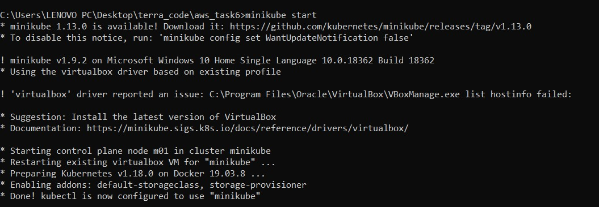
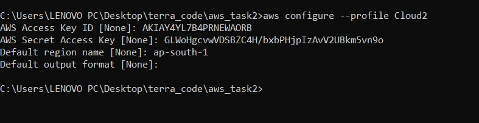
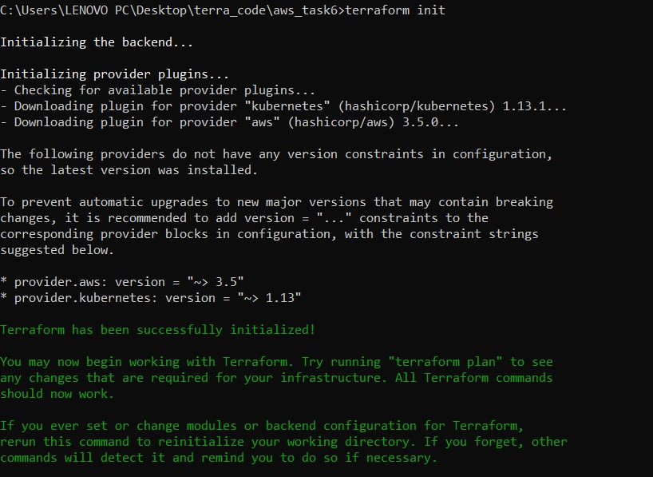
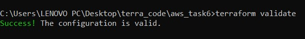
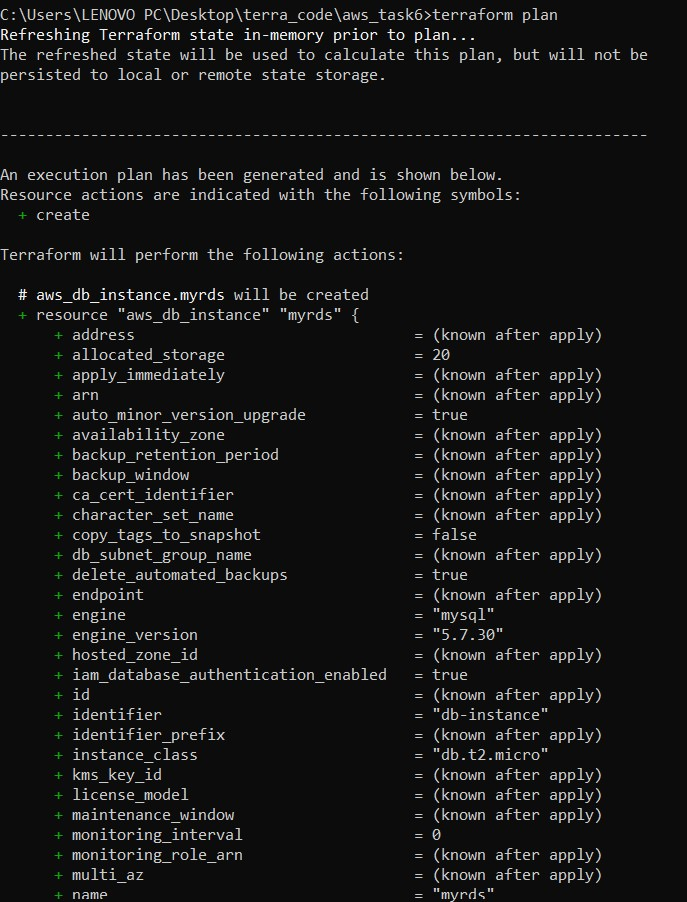
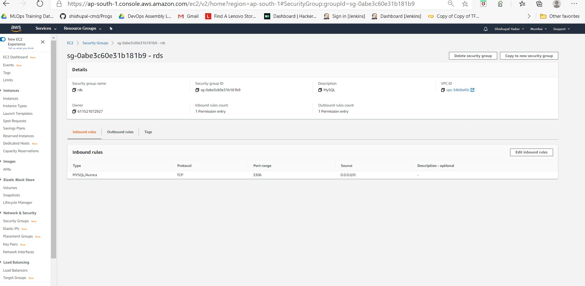

# Deploy Wordpress on K8s using minikube with AWS RDS by Terraform
 
 
 
 
 
##  PROJECT DESCRIPTION
### In this project I have created Infrastructure as code using terraform, which automatically deploy the Wordpress application
###  And in AWS, I have used  RDS service for the relational database for Wordpress application.
###  We can  deploy the Wordpress as a container either on top of Minikube or EKS or Fargate service on AWS 
###  In this project I have deployed the Wordpress on Minikube 
### And this  Wordpress application is  accessible from the public world if deployed on AWS or through workstation if deployed on Minikube.

 


## What is Wordpress

### At its core, WordPress is the simplest, most popular way to create your own website or blog. In fact, WordPress powers over 37.6% of all the websites on the Internet. Yes – more than one in four websites that you visit are likely powered by WordPress.

### On a slightly more technical level, WordPress is an open-source content management system licensed under GPLv2, which means that anyone can use or modify the WordPress software for free. A content management system is basically a tool that makes it easy to manage important aspects of your website – like content – without needing to know anything about programming.

### The end result is that WordPress makes building a website accessible to anyone – even people who aren’t developers.


 


 ## What is AWS RDS 
 
 
 ### Amazon Relational Database Service (Amazon RDS) makes it easy to set up, operate, and scale a relational database in the cloud. It provides cost-efficient and resizable capacity while automating time-consuming administration tasks such as hardware provisioning, database setup, patching and backups. It frees you to focus on your applications so you can give them the fast performance, high availability, security and compatibility they need.

### Amazon RDS is available on several database instance types - optimized for memory, performance or I/O - and provides you with six familiar database engines to choose from, including Amazon Aurora, PostgreSQL, MySQL, MariaDB, Oracle Database, and SQL Server. You can use the AWS Database Migration Service to easily migrate or replicate your existing databases to Amazon RDS.


# Let's begin our project
# Prerequiste for this project
- **Have an AWS account**
-   **Have Minikube installed**
-   **Have erraform CLI installed**
-  **Have AWS CLI installed**
  


## First of aall we have to start minikube in our OS




## After starting minikube  we have to login to AWS from our base OS with some user


 
 
 ## After Login go the directory where we have the code for infrastructure and run the following commands
 ```
 terraform init
 terraform validate 
 terraform plan
 terraform apply --auto-approve
 ```
  
  ## terraform init
     - This command is used to initialize a working directory containing Terraform configuration files.
     
 ## terraform validate
     - This command command validates the configuration files in a directory, referring only to the configuration and not accessing any remote services such as remote state, provider APIs, etc.
     
 ## terraform plan
     - This command is used to create an execution plan. Terraform performs a refresh, unless explicitly disabled, and then determines what actions are necessary to achieve the desired state specified in the configuration files.
     
     
  c
 ## terraform apply --auto-approve
     - This command is used to apply the changes required to reach the desired state of the configuration, or the pre-determined set of actions generated by a terraform plan execution plan.
     
 ## Now let's see the code 
 
 ***Step1***
 - Here is  the provider , the profile and the availibility zone  for our infrastructure
 ``` 
   provider "aws" {
   region = "ap-south-1"
   profile = "Cloud2"
}
```
 ***Step2***
 - Here is the security group 
   
 ```
 resource "aws_security_group" "rds" {
    name="rds"
    description = "MySQL"
    ingress {
        from_port=3306
        to_port=3306
        protocol="tcp"
        cidr_blocks=["0.0.0.0/0"]
        }
     egress {
         from_port=0
         to_port=0
         protocol="-1"
         cidr_blocks=["0.0.0.0/0"]
         }
      }
 ```
 ***Step3***
  -  Now here we provide the information , where(i.e Minikube ) we want to launch Kubernetes 
```
provider "kubernetes" {
  config_context_cluster   = "minikube"
}
```
***Step4***
   - Here is our deployment which would deploy a new pod if the former pod goes down
   - In this code I have created only 1 replicas but we can increase it according to our requirement
```
resource "kubernetes_deployment" "wp" {
  metadata {
    name = "wordpress"
    labels = {
            app = "frontend"
        }
 }
spec {
  replicas = 1
  
  selector {
    match_labels = {
      app = "frontend"
      dc = "IN"
      env = "prod"
    } 
 }
  template {
    metadata {
      labels = {
        app = "frontend"
        dc = "IN"
        env = "prod"
   }
  }
  spec {
    container {
      name = "wordcont" 
      image = "wordpress:4.8-apache"
      env {
           name = "WORDPRESS_DB_HOST"
           value=aws_db_instance.mydb.address
          }
      env {
           name = "WORDPRESS_DB_USER"
           value=aws_db_instance.mydb.username
          }
      env {
           name = "WORDPRESS_DB_PASSWORD"
           value=aws_db_instance.mydb.password
          }
      env {
           name = "WORDPRESS_DB_NAME"
           value=aws_db_instance.mydb.name
          }
      port {
        container_port = 80
     }
    }
   }
  }
 }
}
```
***Step5***
  - Here is load balancer , this will do load balancing  
```
resource "kubernetes_service" "mylb" {
  depends_on = [
      kubernetes_deployment.wp,
    ]
 metadata {
  name = "mylb"
 }
 spec {
  selector = {
    app = "frontend"
  }
  port {
    protocol = "TCP"
    node_port   = 30081 
    port = 80
    target_port = 80
  }
  type = "NodePort"
 }
}
`
```
***Step6***
   - Now here is our database in AWS
   
```
resource "aws_db_instance" "mydb" {
  depends_on = [aws_security_group.rds] 
  allocated_storage    = 20
  identifier           = "db-instance"
  storage_type         = "gp2"
  engine               = "mysql"
  engine_version       = "5.7.30"
  instance_class       = "db.t2.micro"
  name                 = "myrds"
  username             = "singh"
  password             = "redhat963"
  iam_database_authentication_enabled = true
  parameter_group_name = "default.mysql5.7"
  skip_final_snapshot  = true
  publicly_accessible = true
  vpc_security_group_ids= [aws_security_group.rds.id]
  
  tags = {
    Name = "mydb"
  }
}
```
   
